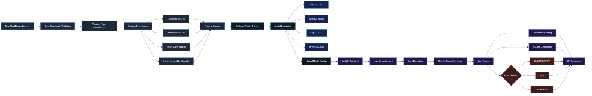

# Aqar Hub 🏠


## Overview

AqarHub is a machine learning powered real estate valuation API for the Egyptian property market. It estimates a property's market value and turns the prediction into a practical decision signal: `UNDERPRICED`, `FAIR`, or `OVERPRICED`, with confidence and human-readable reasons.

## Live API

- API documentation: https://aqarhub-production-29e5.up.railway.app/docs
- Base URL: https://aqarhub-production-29e5.up.railway.app
- Health check: `/health`
- Valuation endpoint: `/api/v1/valuation/analyze`

## Problem Statement

Real estate buyers and sellers often struggle to know whether an asking price is reasonable, especially when listings vary by area, property type, size, finishing, amenities, compound status, and payment structure. AqarHub aims to make this decision easier by combining a price prediction model with a decision engine that explains the pricing signal.

Instead of returning only a numeric estimate, the system produces a portfolio-ready product output:

```json
{
  "alert": "UNDERPRICED",
  "confidence": "HIGH",
  "confidence_score": 85,
  "reason": "Similar apartments in New Cairo typically sell between 3.1M and 3.8M EGP..."
}
```

## Dataset

The model was trained on Egyptian real estate listings with features covering property type, governorate, city, compound, area, room counts, finishing indicators, amenities, listing description signals, and payment-related fields.

Large raw CSV files are ignored by Git to keep the repository clean. To retrain the model, place the dataset at:

```text
egypt_real_estate_listings.csv
```

## Feature Engineering

The training pipeline builds a mix of structured, location-aware, and text-derived features:

- Property basics: size, bedrooms, bathrooms, type, finish, view, and room ratios.
- Location encodings: governorate, city, compound, and city-compound interactions.
- Price-per-square-meter benchmarks by location and property type.
- Listing text features from description length, keyword signals, TF-IDF, and SVD components.
- Market-specific signals for compounds, premium cities, installment terms, furnishing, and North Coast listings.

## Machine Learning Pipeline

The model is trained with CatBoost using a 5-fold validation workflow. The pipeline includes:

- Data cleaning and strict property type normalization.
- K-fold target encoding to reduce leakage risk.
- NLP feature extraction from listing descriptions.
- Feature selection based on CatBoost importance plus required domain features.
- Final CatBoost ensemble saved as a Joblib bundle.

Main training entry point:

```bash
python train.py
```

## Model Performance

The latest training run reports the following performance:

| Metric | Value |
| --- | ---: |
| Train R2 | 0.8327 |
| Test R2 | 0.8296 |
| Generalization Gap | 0.0032 |
| Test MAPE | 20.29% |
| Selected Features | 53 |

The model keeps nearly identical train and test performance, which suggests strong generalization and limited overfitting. This is especially important in real estate pricing, where market noise, location variance, and listing quality can easily make a model memorize patterns instead of learning reusable pricing signals.

Per-property-type MAPE:

| Property Type | MAPE |
| --- | ---: |
| Apartment | 18.61% |
| Chalet | 20.35% |
| Duplex | 23.01% |
| Penthouse | 16.97% |
| Villa | 22.93% |

## Alert System

The alert engine converts model predictions into decision-focused output. It compares the asking price against the expected price interval and returns:

- `UNDERPRICED`: the asking price is below the expected market range.
- `FAIR`: the asking price is within the expected market range.
- `OVERPRICED`: the asking price is above the expected market range.

The decision engine also adds:

- Confidence level: `LOW`, `MEDIUM`, or `HIGH`.
- Confidence score.
- English and Arabic explanations.
- Safety checks for rare property types, weak market coverage, and extreme price deviations.

This makes AqarHub closer to a real decision-support product than a simple price prediction script.

## Installation

Clone the repository:

```bash
git clone https://github.com/AliMostafasaad/Aqarhub.git
cd Aqarhub
```

Create and activate a virtual environment:

```bash
python -m venv .venv
.venv\Scripts\activate
```

Install dependencies:

```bash
pip install -r requirements.txt
```

## Usage

Run the FastAPI app locally:

```bash
uvicorn main:app --reload
```

Open the API documentation:

```text
http://127.0.0.1:8000/docs
```

Example request:

```bash
curl -X POST "http://127.0.0.1:8000/api/v1/valuation/analyze" ^
  -H "Content-Type: application/json" ^
  -d "{\"property_type\":\"Apartment\",\"governorate\":\"Cairo\",\"city\":\"New Cairo\",\"detailed_address\":\"Fifth Settlement\",\"bedrooms\":3,\"bathrooms\":2,\"size_sqm\":150,\"amenities\":[\"elevator\",\"security\"],\"asking_price\":4500000,\"description\":\"Apartment for sale in New Cairo with premium finishing\"}"
```

## Project Structure

```text
AqarHub/
|-- main.py                         # FastAPI application
|-- train.py                        # Model training pipeline
|-- api_demo.py                     # Demo for production-style output
|-- alert_engine.py                 # Alert, confidence, and reason engine
|-- features.py                     # Feature engineering utilities
|-- data.py                         # Dataset cleaning and preparation
|-- models.py                       # Model wrapper classes
|-- config.py                       # Project configuration
|-- aqar_hub_v22_model.joblib       # Saved model bundle
|-- requirements.txt                # Python dependencies
`-- README.md
```
## Project Workflow



## Results

AqarHub currently combines valuation, market-range estimation, alert classification, confidence scoring, and reason generation in one API workflow. The strongest portfolio angle is the Alert Engine: it turns raw ML predictions into a clear product-style decision that users can act on.
